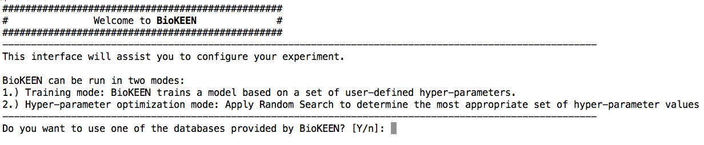
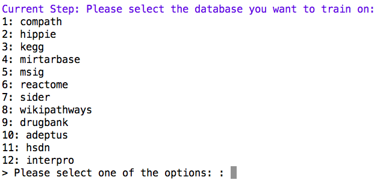

Train and Evaluate
==================
Tutorial
--------
Step 1: Start CLI
~~~~~~~~~~~~~~~~~
.. code-block:: sh

   biokeen start

Step 2: Select data source
~~~~~~~~~~~~~~~~~~~~~~~~~~

Step 3: Select database
~~~~~~~~~~~~~~~~~~~~~~~

Step 4: Specify execution mode
~~~~~~~~~~~~~~~~~~~~~~~~~~~~~~
.. image:: ../images/execution_mode.png

Step 5: Select KGE model
~~~~~~~~~~~~~~~~~~~~~~~~
.. image:: ../images/select_model.png

Step 6: Specify model dependent hyper-parameters
~~~~~~~~~~~~~~~~~~~~~~~~~~~~~~~~~~~~~~~~~~~~~~~~

Step 7: Specify the batch-size
~~~~~~~~~~~~~~~~~~~~~~~~~~~~~~
.. image:: ../images/batch_size.png

Step 8: Specify the number of training epochs
~~~~~~~~~~~~~~~~~~~~~~~~~~~~~~~~~~~~~~~~~~~~~
.. image:: ../images/epochs.png

Step 9: Specify whether to evaluate the model
~~~~~~~~~~~~~~~~~~~~~~~~~~~~~~~~~~~~~~~~~~~~~
.. image:: ../images/epochs.png

Step 10: Specify whether to evaluate the model
~~~~~~~~~~~~~~~~~~~~~~~~~~~~~~~~~~~~~~~~~~~~~~
.. image:: ../images/epochs.png

Step 11: Provide a random seed
~~~~~~~~~~~~~~~~~~~~~~~~~~~~~~
.. image:: ../images/random_seed.png

Step 12: Specify preferred device
~~~~~~~~~~~~~~~~~~~~~~~~~~~~~~~~~
.. image:: ../images/preferred_device.png

Step 13: Specify the path to the output directory
~~~~~~~~~~~~~~~~~~~~~~~~~~~~~~~~~~~~~~~~~~~~~~~~~
.. image:: ../images/output_directory.png

Reference
---------
.. click:: biokeen.cli.cli:train
   :prog: biokeen
   :show-nested:
